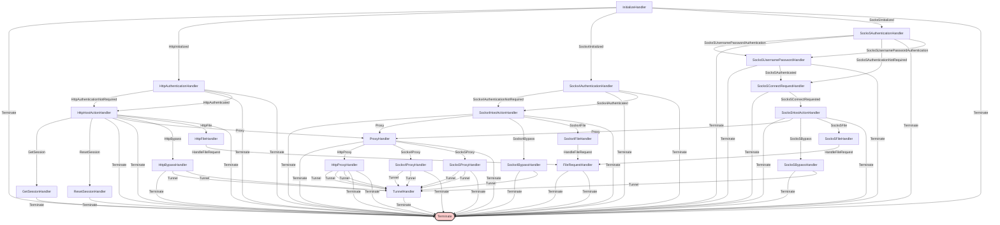

```mermaid
graph TD
    %% Styling for terminal (end) states
    classDef terminal fill:#fcc,stroke:#333,stroke-width:2px;
    FileRequestHandler -- Terminate --> Terminal_Terminate([Terminate])
    class Terminal_Terminate terminal;
    FileRequestHandler -- Terminate --> Terminal_Terminate([Terminate])
    class Terminal_Terminate terminal;
    GetSessionHandler -- Terminate --> Terminal_Terminate([Terminate])
    class Terminal_Terminate terminal;
    HttpAuthenticationHandler -- HttpAuthenticationNotRequired --> HttpHostActionHandler
    HttpAuthenticationHandler -- Terminate --> Terminal_Terminate([Terminate])
    class Terminal_Terminate terminal;
    HttpAuthenticationHandler -- HttpAuthenticated --> HttpHostActionHandler
    HttpAuthenticationHandler -- Terminate --> Terminal_Terminate([Terminate])
    class Terminal_Terminate terminal;
    HttpBypassHandler -- Terminate --> Terminal_Terminate([Terminate])
    class Terminal_Terminate terminal;
    HttpBypassHandler -- Tunnel --> TunnelHandler
    HttpBypassHandler -- Tunnel --> TunnelHandler
    HttpFileHandler -- HandleFileRequest --> FileRequestHandler
    HttpHostActionHandler -- GetSession --> GetSessionHandler
    HttpHostActionHandler -- ResetSession --> ResetSessionHandler
    HttpHostActionHandler -- Terminate --> Terminal_Terminate([Terminate])
    class Terminal_Terminate terminal;
    HttpHostActionHandler -- Terminate --> Terminal_Terminate([Terminate])
    class Terminal_Terminate terminal;
    HttpHostActionHandler -- Proxy --> ProxyHandler
    HttpHostActionHandler -- HttpBypass --> HttpBypassHandler
    HttpHostActionHandler -- HttpFile --> HttpFileHandler
    HttpHostActionHandler -- Terminate --> Terminal_Terminate([Terminate])
    class Terminal_Terminate terminal;
    HttpProxyHandler -- Tunnel --> TunnelHandler
    HttpProxyHandler -- Tunnel --> TunnelHandler
    HttpProxyHandler -- Tunnel --> TunnelHandler
    HttpProxyHandler -- Terminate --> Terminal_Terminate([Terminate])
    class Terminal_Terminate terminal;
    HttpProxyHandler -- Terminate --> Terminal_Terminate([Terminate])
    class Terminal_Terminate terminal;
    InitializeHandler -- Terminate --> Terminal_Terminate([Terminate])
    class Terminal_Terminate terminal;
    InitializeHandler -- HttpInitialized --> HttpAuthenticationHandler
    InitializeHandler -- Socks4Initialized --> Socks4AuthenticationHandler
    InitializeHandler -- Socks5Initialized --> Socks5AuthenticationHandler
    InitializeHandler -- Terminate --> Terminal_Terminate([Terminate])
    class Terminal_Terminate terminal;
    ProxyHandler -- Terminate --> Terminal_Terminate([Terminate])
    class Terminal_Terminate terminal;
    ProxyHandler -- HttpProxy --> HttpProxyHandler
    ProxyHandler -- Socks4Proxy --> Socks4ProxyHandler
    ProxyHandler -- Socks5Proxy --> Socks5ProxyHandler
    ProxyHandler -- Terminate --> Terminal_Terminate([Terminate])
    class Terminal_Terminate terminal;
    ResetSessionHandler -- Terminate --> Terminal_Terminate([Terminate])
    class Terminal_Terminate terminal;
    Socks4AuthenticationHandler -- Socks4AuthenticationNotRequired --> Socks4HostActionHandler
    Socks4AuthenticationHandler -- Terminate --> Terminal_Terminate([Terminate])
    class Terminal_Terminate terminal;
    Socks4AuthenticationHandler -- Socks4Authenticated --> Socks4HostActionHandler
    Socks4AuthenticationHandler -- Terminate --> Terminal_Terminate([Terminate])
    class Terminal_Terminate terminal;
    Socks4BypassHandler -- Terminate --> Terminal_Terminate([Terminate])
    class Terminal_Terminate terminal;
    Socks4BypassHandler -- Tunnel --> TunnelHandler
    Socks4FileHandler -- HandleFileRequest --> FileRequestHandler
    Socks4HostActionHandler -- Terminate --> Terminal_Terminate([Terminate])
    class Terminal_Terminate terminal;
    Socks4HostActionHandler -- Proxy --> ProxyHandler
    Socks4HostActionHandler -- Socks4Bypass --> Socks4BypassHandler
    Socks4HostActionHandler -- Socks4File --> Socks4FileHandler
    Socks4HostActionHandler -- Terminate --> Terminal_Terminate([Terminate])
    class Terminal_Terminate terminal;
    Socks4ProxyHandler -- Tunnel --> TunnelHandler
    Socks4ProxyHandler -- Tunnel --> TunnelHandler
    Socks4ProxyHandler -- Terminate --> Terminal_Terminate([Terminate])
    class Terminal_Terminate terminal;
    Socks5AuthenticationHandler -- Socks5UsernamePasswordAuthentication --> Socks5UsernamePasswordHandler
    Socks5AuthenticationHandler -- Terminate --> Terminal_Terminate([Terminate])
    class Terminal_Terminate terminal;
    Socks5AuthenticationHandler -- Socks5AuthenticationNotRequired --> Socks5ConnectRequestHandler
    Socks5AuthenticationHandler -- Terminate --> Terminal_Terminate([Terminate])
    class Terminal_Terminate terminal;
    Socks5AuthenticationHandler -- Socks5UsernamePasswordAuthentication --> Socks5UsernamePasswordHandler
    Socks5BypassHandler -- Terminate --> Terminal_Terminate([Terminate])
    class Terminal_Terminate terminal;
    Socks5BypassHandler -- Tunnel --> TunnelHandler
    Socks5ConnectRequestHandler -- Terminate --> Terminal_Terminate([Terminate])
    class Terminal_Terminate terminal;
    Socks5ConnectRequestHandler -- Socks5ConnectRequested --> Socks5HostActionHandler
    Socks5FileHandler -- HandleFileRequest --> FileRequestHandler
    Socks5HostActionHandler -- Terminate --> Terminal_Terminate([Terminate])
    class Terminal_Terminate terminal;
    Socks5HostActionHandler -- Proxy --> ProxyHandler
    Socks5HostActionHandler -- Socks5Bypass --> Socks5BypassHandler
    Socks5HostActionHandler -- Socks5File --> Socks5FileHandler
    Socks5HostActionHandler -- Terminate --> Terminal_Terminate([Terminate])
    class Terminal_Terminate terminal;
    Socks5ProxyHandler -- Tunnel --> TunnelHandler
    Socks5ProxyHandler -- Tunnel --> TunnelHandler
    Socks5ProxyHandler -- Terminate --> Terminal_Terminate([Terminate])
    class Terminal_Terminate terminal;
    Socks5UsernamePasswordHandler -- Terminate --> Terminal_Terminate([Terminate])
    class Terminal_Terminate terminal;
    Socks5UsernamePasswordHandler -- Socks5Authenticated --> Socks5ConnectRequestHandler
    Socks5UsernamePasswordHandler -- Terminate --> Terminal_Terminate([Terminate])
    class Terminal_Terminate terminal;
    TunnelHandler -- Terminate --> Terminal_Terminate([Terminate])
    class Terminal_Terminate terminal;
```
