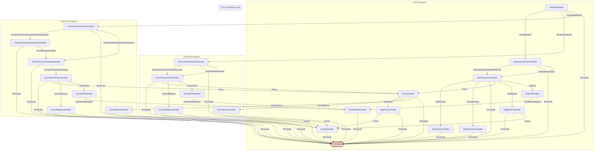

```mermaid
graph TD
    %% Styling for terminal (end) states
    classDef terminal fill:#fcc,stroke:#333,stroke-width:2px;
    subgraph HTTP [HTTP Protocol]
        HttpAuthenticationHandler -- HttpAuthenticationNotRequired --> HttpHostActionHandler
        HttpAuthenticationHandler -- Terminate --> Terminal_Terminate([Terminate])
    class Terminal_Terminate terminal;
        HttpAuthenticationHandler -- HttpAuthenticated --> HttpHostActionHandler
        HttpBypassHandler -- Terminate --> Terminal_Terminate([Terminate])
    class Terminal_Terminate terminal;
        HttpBypassHandler -- Tunnel --> TunnelHandler
        HttpFileHandler -- HandleFileRequest --> FileRequestHandler
        HttpHostActionHandler -- GetSession --> GetSessionHandler
        HttpHostActionHandler -- ResetSession --> ResetSessionHandler
        HttpHostActionHandler -- Terminate --> Terminal_Terminate([Terminate])
    class Terminal_Terminate terminal;
        HttpHostActionHandler -- Proxy --> ProxyHandler
        HttpHostActionHandler -- HttpBypass --> HttpBypassHandler
        HttpHostActionHandler -- HttpFile --> HttpFileHandler
        HttpProxyHandler -- Tunnel --> TunnelHandler
        HttpProxyHandler -- Terminate --> Terminal_Terminate([Terminate])
    class Terminal_Terminate terminal;
        InitializeHandler -- HttpInitialized --> HttpAuthenticationHandler
        ProxyHandler -- HttpProxy --> HttpProxyHandler
    end

    subgraph Socks4 [SOCKS4 Protocol]
        InitializeHandler -- Socks4Initialized --> Socks4AuthenticationHandler
        ProxyHandler -- Socks4Proxy --> Socks4ProxyHandler
        Socks4AuthenticationHandler -- Socks4AuthenticationNotRequired --> Socks4HostActionHandler
        Socks4AuthenticationHandler -- Terminate --> Terminal_Terminate([Terminate])
    class Terminal_Terminate terminal;
        Socks4AuthenticationHandler -- Socks4Authenticated --> Socks4HostActionHandler
        Socks4BypassHandler -- Terminate --> Terminal_Terminate([Terminate])
    class Terminal_Terminate terminal;
        Socks4BypassHandler -- Tunnel --> TunnelHandler
        Socks4FileHandler -- HandleFileRequest --> FileRequestHandler
        Socks4HostActionHandler -- Terminate --> Terminal_Terminate([Terminate])
    class Terminal_Terminate terminal;
        Socks4HostActionHandler -- Proxy --> ProxyHandler
        Socks4HostActionHandler -- Socks4Bypass --> Socks4BypassHandler
        Socks4HostActionHandler -- Socks4File --> Socks4FileHandler
        Socks4ProxyHandler -- Tunnel --> TunnelHandler
        Socks4ProxyHandler -- Terminate --> Terminal_Terminate([Terminate])
    class Terminal_Terminate terminal;
    end

    subgraph Socks5 [SOCKS5 Protocol]
        InitializeHandler -- Socks5Initialized --> Socks5AuthenticationHandler
        ProxyHandler -- Socks5Proxy --> Socks5ProxyHandler
        Socks5AuthenticationHandler -- Socks5UsernamePasswordAuthentication --> Socks5UsernamePasswordHandler
        Socks5AuthenticationHandler -- Terminate --> Terminal_Terminate([Terminate])
    class Terminal_Terminate terminal;
        Socks5AuthenticationHandler -- Socks5AuthenticationNotRequired --> Socks5ConnectRequestHandler
        Socks5BypassHandler -- Terminate --> Terminal_Terminate([Terminate])
    class Terminal_Terminate terminal;
        Socks5BypassHandler -- Tunnel --> TunnelHandler
        Socks5ConnectRequestHandler -- Terminate --> Terminal_Terminate([Terminate])
    class Terminal_Terminate terminal;
        Socks5ConnectRequestHandler -- Socks5ConnectRequested --> Socks5HostActionHandler
        Socks5FileHandler -- HandleFileRequest --> FileRequestHandler
        Socks5HostActionHandler -- Terminate --> Terminal_Terminate([Terminate])
    class Terminal_Terminate terminal;
        Socks5HostActionHandler -- Proxy --> ProxyHandler
        Socks5HostActionHandler -- Socks5Bypass --> Socks5BypassHandler
        Socks5HostActionHandler -- Socks5File --> Socks5FileHandler
        Socks5ProxyHandler -- Tunnel --> TunnelHandler
        Socks5ProxyHandler -- Terminate --> Terminal_Terminate([Terminate])
    class Terminal_Terminate terminal;
        Socks5UsernamePasswordHandler -- Terminate --> Terminal_Terminate([Terminate])
    class Terminal_Terminate terminal;
        Socks5UsernamePasswordHandler -- Socks5Authenticated --> Socks5ConnectRequestHandler
    end

    subgraph General [Core & General Logic]
        FileRequestHandler -- Terminate --> Terminal_Terminate([Terminate])
    class Terminal_Terminate terminal;
        GetSessionHandler -- Terminate --> Terminal_Terminate([Terminate])
    class Terminal_Terminate terminal;
        InitializeHandler -- Terminate --> Terminal_Terminate([Terminate])
    class Terminal_Terminate terminal;
        ProxyHandler -- Terminate --> Terminal_Terminate([Terminate])
    class Terminal_Terminate terminal;
        ResetSessionHandler -- Terminate --> Terminal_Terminate([Terminate])
    class Terminal_Terminate terminal;
        TunnelHandler -- Terminate --> Terminal_Terminate([Terminate])
    class Terminal_Terminate terminal;
    end
```
